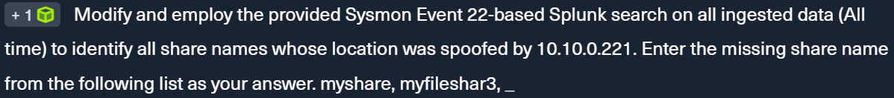

### Detecting Responder-like Attacks

LLMNR/NBT-NS/mDNS Poisoning aka NBNS spoofing are **network-level attacks** exploiting the name resolution protocols. 

When FQDN resolution fails, these protocols are used on local network instead. The adversary can employ [Responder](https://github.com/lgandx/Responder) tool to perform poisoning.


**Detection**:
We can look for the unusual LLMNR and NBT-NS traffic patterns and create a honeypot for non existent hosts


**Question:**



Here is the given Splunk search:

```
index=main earliest=1690290078 latest=1690291207 EventCode=22 
| table _time, Computer, user, Image, QueryName, QueryResults
```

This search is looking for Event ID **22** (Failed Logon), filter for all Results that returns 10.10.0.221 and then look for the share name.


