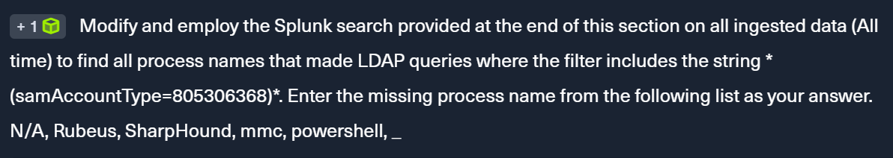
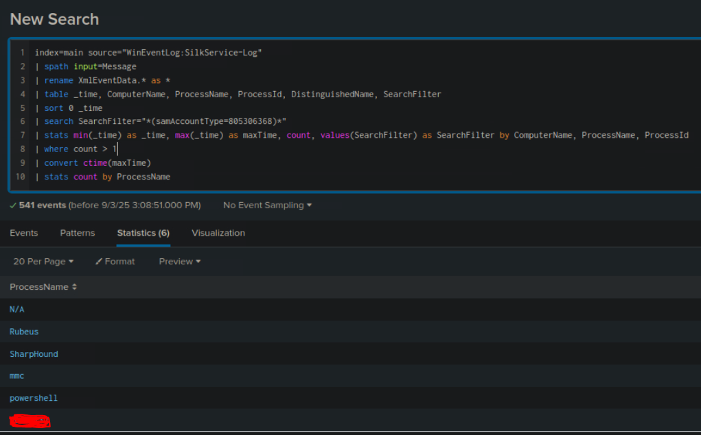
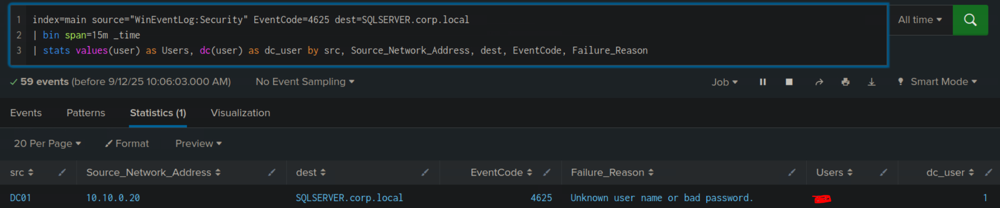

# 

Hi, I'm thng01, a soon graduate student currently building my skills in cybersecurity. 


I created this note to document my journey, revise what I’ve learned, and share detailed write-ups of HTB SOC Job Path. My goal is to strengthen my investigation, detection, and analysis skills while preparing for my career in a Security Operations Center.

You will not find any flag nor answer for questions in this blog, but only my summary as well as thought-process after learning this module. I encourage trying to understand and solve the question on your own, and come back to see if we share the same approach or see a difference aspect of the problem.

Enjoy!


### Detecting Common User/Domain Recon

Active Directory Domain Reconnaissance is a indispensable step during an cyberattack lifecycle, as to determine the architecture, network as well as potential victims.


There are some native executables to perform AD reconnaissance:

*  **net group** cmd: can be used to list "Domain Admins" in domain
* **whoami /all**
* **wmic computersystem get domain**
* **net user /domain**
* **net group "Domain Admins" /domain**
* **arp -a**
* **nltest /domain_trusts**

These commands can be an indicator of an attack.

Or, there is a set of tools specialised for this job:  BloodHound/SharpHound\

* BloodHound: open-source tool for analyse and visualize AD to clarify trust relationships, permissions, group memberships in AD environment
* Sharphound: a C# data collector for BloodHound


So how can we detect these actions?

As any other reconnaissance tool, this one executes several LDAP queries to the DC to gather info about the domain. However Windows Event Logs does not record LDAP queries. There are other options like:

* Windows ETW **Microsoft-Windows-LDAP-Client** provider: quick, efficient and Yara-compatible ([Useful list of LDAP filter for reconnaissance tools](https://techcommunity.microsoft.com/blog/microsoftdefenderatpblog/hunting-for-reconnaissance-activities-using-ldap-search-filters/824726))
* Splunk: Which we are gonna focus on 

We can detect recon base on those 2 approaches.


**Questions:**



Here is the Splunk search given. This is a detection base on targeting BloodHound

```spl
index=main earliest=1690195896 latest=1690285475 source="WinEventLog:SilkService-Log"
| spath input=Message 
| rename XmlEventData.* as * 
| table _time, ComputerName, ProcessName, ProcessId, DistinguishedName, SearchFilter
| sort 0 _time
| search SearchFilter="*(samAccountType=805306368)*"
| stats min(_time) as _time, max(_time) as maxTime, count, values(SearchFilter) as SearchFilter by ComputerName, ProcessName, ProcessId
| where count > 10
| convert ctime(maxTime)
```

The task requires us : All time, all process with LDAP queries and filter for samAccountType. So here is what I did:

1. Set time to All time
2. Lower the count to 1 to get more process
3. Add stats for Processname (optional)



The answer is a process that is very familiar throughout the module.


### Detecting Password Spraying

Password Spraying is an attack where the attacker use a small common set of passwords for multiple accounts. It's like multiple accounts - 1 password compared to bruteforce attack (1 account - multiple passwords).

The pattern of this type of attack is <span style="color:green">Event ID 4625 - Failed Logon </span>. There are also other event log that can help:

* 4768 and ErrorCode 0x6 - Kerberos Invalid Users
* 4768 and ErrorCode 0x12 - Kerberos Disabled Users
* 4776 and ErrorCode 0xC000006A - NTLM Invalid Users
* 4776 and ErrorCode 0xC0000064 - NTLM Wrong Password
* 4648 - Authenticate Using Explicit Credentials
* 4771 - Kerberos Pre-Authentication Failed


**Question:**


Here is the given Splunk search:

```
index=main earliest=1690280680 latest=1690289489 source="WinEventLog:Security" EventCode=4625
| bin span=15m _time
| stats values(user) as Users, dc(user) as dc_user by src, Source_Network_Address, dest, EventCode, Failure_Reason
```

This search is looking for Event ID **4625** (Failed Logon), within a timeframe, with a **timebucket of 15 minutes** and then aggregate the results by 5 factors above.

<span style="color:green">bin span=15m _time</span> will floor the event's `_time` to interval of 15 minutes (ex: 09:07 -> 09:00, 09:25 -> 09:15)


To solve this, simply change the search to **All time**, and add filter for the targeted machine.



