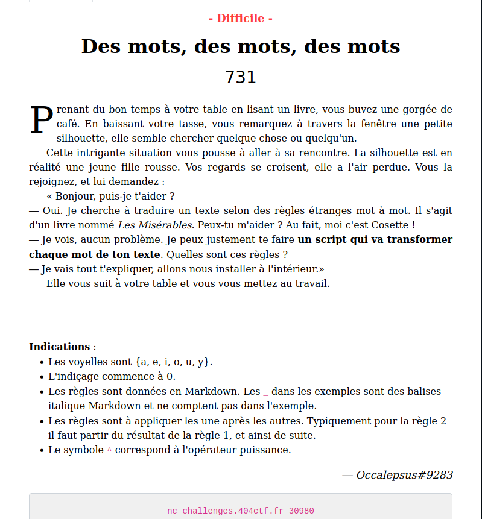

## ## Challenge Description



This is a programming challenge which requires us to write a "translator" abiding their rules.

## ## Solution

After having connected to the server, they introduced to us the rules, one by one. The first thing we see is:

```
$ nc challenges.404ctf.fr 30980 
Commençons. Je te propose de démarrer en transformant mon nom.
Tout d'abord retourne mon nom sans modifications.
Règle 0 : Aucune modification
Entrée : {cosette}
>> 
```

So the rule #0 is a demo, we need to send the word without modification `cosette`. Then we begin.

```
Je vois que tu as compris. La première règle de ce langage est très simple.
Règle 1 : Inverser les lettres
Entrée : {cosette}
>
```

The rule #1 is: Inverse the letters in the word. This one is simple.

Keep doing this to find out all the rule. Here is the output of my terminal:

```
Commençons. Je te propose de démarrer en transformant mon nom.
Tout d'abord retourne mon nom sans modifications.
Règle 0 : Aucune modification
Entrée : {cosette}
>>cosette
Je vois que tu as compris. La première règle de ce langage est très simple.
Règle 1 : Inverser les lettres
Entrée : {cosette}
>>ettesoc
Oui c'est bien. Maintenant la deuxième règle est un peu plus difficile.
Règle 2 :
- Si le mot à un nombre de lettres pair, échanger la 1ere et la 2e partie du mot obtenu
- Sinon, enlever toutes les lettres du mot correspondant à la lettre centrale
Entrée : {cosette}
>>ttsoc
Tu t'en sors très bien ! Continuons avec la troisième règle.
Règle 3 :
_Si le mot a 3 lettres ou plus_ :

- Si la 3e lettre du mot obtenu est une consonne, "décaler" les voyelles vers la gauche dans le mot original, puis réappliquer les règles 1 et 2.
- Sinon : la même chose mais les décaler vers la droite.

> Ex de décalage : _poteau => petauo_ // _drapeau => drupaea_
Entrée : {cosette}
>>
ottsc
Nous avons presque fini, la quatrième règle est la plus complexe.
Règle 4 :
- Pour `n` allant de 0 à la fin du mot, si le caractère `c` à la position `n` du mot est une consonne (majuscule ou minuscule), insérer en position `n+1` le caractère de code ASCII `a = ((vp + s) % 95) + 32`, où `vp` est le code ASCII de la voyelle précédant la consonne `c` dans l'alphabet (si `c = 'F'`, `vp = 'E'`), et `s = SOMME{i=n-1 -> 0}(a{i}*2^(n-i)*Id(l{i} est une voyelle))`, où `a{i}` est le code ASCII de la `i`-ième lettre du mot, `Id(x)` vaut `1` si `x` est vrai, `0` sinon, et `l{i}` la `i`-ième lettre du mot. _Attention à bien appliquer cette règle aussi sur les caractères insérés au mot._

> Ex : _futur => f&ut\ur@_

```

There are something to keep in mind:

* The vowels are {a, e, i, o, u, y}.
* The index starts at 0.
* The rules are given in Markdown. The _ in the examples are italic Markdown tags and do not count in the example.
*  The rules are to be applied one after the other. Typically for rule 2 it is necessary to start from the result of rule 1, and so on. Which means, if I implement function like rule1(). rule2() etc.., the output is rule2(rule1(the_word)).
* The symbol ^ corresponds to the power operator.

Then to get the flag, we need to translate a set of random words in french called chapter 1 to this language.

Here is the code I used to get the flag:

```python
import socket
import re
from time import sleep
from copy import deepcopy
from collections import Counter

voyelles = ['a', 'e','i', 'o', 'u', 'y', 'A', 'E', 'I', 'O' , 'U', 'Y']


def extract_data(input_string):
    pattern = r'\{(.*?)\}'  # Regular expression pattern to match text within {}
    matches = re.findall(pattern, input_string)
    
    return ''.join(matches)

def one(word):
	return word[::-1]

def two(word):
	if (len(word)%2) == 0:
		mid = len(word) // 2
		word = word[mid:] + word[:mid]
		return word
	else:
		mid = len(word) // 2
		word = word.replace(word[mid],'')
		return word

def shift_vowels_left(word):
	tmp = '9696'
	res = ''
	#Iterate backward
	for i in range(len(word)-1,-1,-1):
		if word[i] in voyelles:
			res = tmp + res
			tmp = word[i]
		else:
			res = word[i] + res
	return res.replace("9696", tmp)


def shift_vowels_right(word):
	tmp = '6969'
	res = ''
	for i in range(len(word)):
		if word[i] in voyelles:
			res = res + tmp
			tmp = word[i]
		else:
			res = res + word[i]
	return res.replace("6969", tmp)

def three(word):
	#if (len(word) >= 3):
		#oldw = old # get the original word
		if two(one(word))[2] in voyelles:
			#shift right, then 1 and 2
			word =  shift_vowels_right(word)
			word = two(one(word))
			return word
		else:
			#shift left, then 1 and 2
			word =  shift_vowels_left(word)
			word = two(one(word))
			return word

def ld(i,w):
	if w[i] in voyelles:
		return 1
	return 0
def a(i,w):
	return ord(w[i])

def vp(c):
	i = ord(c)
	while True:
		if chr(i) in voyelles:
			return i
		else:
			i = i-1 

def s(n,w):
	sum = 0
	for i in range(n-1, -1, -1):
		sum = sum + a(i,w)*2**(n-i)*ld(i,w)
	return sum

def sort_word(word):
	char_counts = Counter(word)
	sorted_chars = sorted(char_counts.keys(), key=lambda char: (-char_counts[char], ord(char)))

	sorted_chars = sorted(char_counts.keys(), key=lambda char: (-char_counts[char], ord(char)))
	sorted_word = ''.join(char * char_counts[char] for char in sorted_chars)
	return sorted_word

def four(word):
	i=0
	k=1
	res = word
	tmp = ''
	while i < len(res):
		if res[i] not in voyelles and res[i].isalpha():
			a = ((vp(res[i]) + s(i,res)) % 95) + 32
			res = res[:i+1] + chr(a) + res[i+1:]
		i = i + 1
	return sort_word(res)
	
			
def translate(words):
	list = words.split()
	final = []
	for w in list:
		if len(two(one(w))) >=3:
			w = four(three(w))
			final.append(w)
		else:
			#w = four(three(two(one(w))))
			w = four(two(one(w)))
			final.append(w)
	return ' '.join(final)


sock = socket.socket(socket.AF_INET, socket.SOCK_STREAM)
sock.connect(('challenges.404ctf.fr', 30980))
i = 0
answer = ["cosette"]
answer.append(one("cosette"))
answer.append(two(one("cosette")))
answer.append(three("cosette"))
answer.append(four(three("cosette")))
for x in answer:
	data = sock.recv(4096)
	quiz = data.decode('utf-8').strip()
	print(quiz)
	sock.sendall(x.encode('ascii')+b'\n')
	print(x)
	sleep(1)
	if x == 'PPtt!15QRUWcos':
		print("STARTING...\n")	
		while True:
			data = sock.recv(4096)
			if not data:
				break
			quiz = data.decode('utf-8').strip()
			print(quiz)
			chapter = extract_data(quiz)
			ans = translate(chapter)
			sock.sendall(ans.encode('ascii')+b'\n')
			print(ans)
			sleep(1)
sock.close()
```

And here is the result:

```
$python3 desmots.py
Commençons. Je te propose de démarrer en transformant mon nom.
Tout d'abord retourne mon nom sans modifications.
Règle 0 : Aucune modification
Entrée : {cosette}
>>
cosette
Je vois que tu as compris. La première règle de ce langage est très simple.
Règle 1 : Inverser les lettres
Entrée : {cosette}
>>
ettesoc
Oui c'est bien. Maintenant la deuxième règle est un peu plus difficile.
Règle 2 :
- Si le mot à un nombre de lettres pair, échanger la 1ere et la 2e partie du mot obtenu
- Sinon, enlever toutes les lettres du mot correspondant à la lettre centrale
Entrée : {cosette}
>>
ttsoc
Tu t'en sors très bien ! Continuons avec la troisième règle.
Règle 3 :
_Si le mot a 3 lettres ou plus_ :

- Si la 3e lettre du mot obtenu est une consonne, "décaler" les voyelles vers la gauche dans le mot original, puis réappliquer les règles 1 et 2.
- Sinon : la même chose mais les décaler vers la droite.

> Ex de décalage : _poteau => petauo_ // _drapeau => drupaea_
Entrée : {cosette}
>>
ottsc
Nous avons presque fini, la quatrième règle est la plus complexe.
Règle 4 :
- Pour `n` allant de 0 à la fin du mot, si le caractère `c` à la position `n` du mot est une consonne (majuscule ou minuscule), insérer en position `n+1` le caractère de code ASCII `a = ((vp + s) % 95) + 32`, où `vp` est le code ASCII de la voyelle précédant la consonne `c` dans l'alphabet (si `c = 'F'`, `vp = 'E'`), et `s = SOMME{i=n-1 -> 0}(a{i}*2^(n-i)*Id(l{i} est une voyelle))`, où `a{i}` est le code ASCII de la `i`-ième lettre du mot, `Id(x)` vaut `1` si `x` est vrai, `0` sinon, et `l{i}` la `i`-ième lettre du mot. _Attention à bien appliquer cette règle aussi sur les caractères insérés au mot._

> Ex : _futur => f&ut\ur@_

- Enfin, trier le mot par ordre décroissant d'occurrences des caractères, puis par ordre croissant en code ASCII pour les égalités

> Ex de tri : _patate => aattep_
Entrée : {cosette}
>>
PPtt!15QRUWcos
STARTING...

Bravo ! Maintenant je vais te donner un chapitre dont j'ai besoin de la traduction complète.
Chaque mot est écrit en minuscule sans accents ni caractères spéciaux et sont séparés par un espace. Tu as 5 secondes pour répondre.
Entrée : {lendemain soleil levant monseigneur bienvenu promenait jardin madame magloire accourut toute bouleversee monseigneur monseigneur votre grandeur panier argenterie eveque jesus reprit savais etait devenu eveque venait ramasser panier plate bande presenta madame magloire voila dedans argenterie repartit eveque argenterie occupe grand volee homme volee toute vivacite vieille alerte madame magloire courut oratoire entra alcove revint eveque eveque venait baisser considerait soupirant plant cochlearia guillons panier avait brise tombant travers plate bande redressa madame magloire monseigneur homme parti argenterie volee poussant cette exclamation tombaient angle jardin voyait traces escalade chevron avait arrache tenez saute ruelle cochefilet abomination notre argenterie eveque resta}
>>
Merci ! C'est exactement ce qu'il me fallait !
Voici ta récompense : 404CTF{:T]cdeikm_)W_doprsu_nt_;adei}

```

And we got the flag `**404CTF{:T]cdeikm_)W_doprsu_nt_;adei}**`
