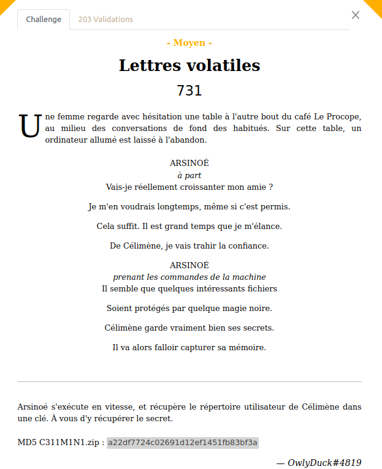

## ## Challenge Description



In this challenges, we are given a zip file containning a Windows home directory of `C311M1N1`. 

We need to perform forensic analysis on this file to find a flag

## ## Solution

After looking around a bit, I found a suspicious zip file with **lettreAOronte.pdf** in it. Taking the name of the challenge as a hint, I believed this is the flag. However the zip is protected with a password.

In the location `Documents/JumpBag/` we can see a **raw** file, and once again, as the challenge name is Lettres Volatiles, I used `Volatility` to analyse it. I used [[volatility2]](https://github.com/volatilityfoundation/volatility/wiki/Installation) to analyse this time.

```
vol2 -f C311M1M1-PC-20230514-200525.raw imageinfo
```

I saw the profile is Win7SP1x64, and tried to enumerate around with processes, different offset... But there's not really anything.

But when it comes to `clipboard`, which allows us to dump the clipboard and I found the password for the zip!


Extract the zip and I got the file [lettreAOronte.pdf]()

Flag: `404CTF{V0147i1I7y_W1Ll_N3v3r_Wr8_loV3_l3ttEr5}`
