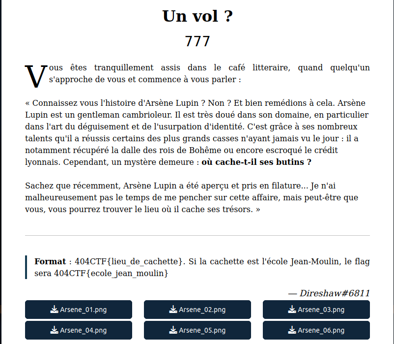
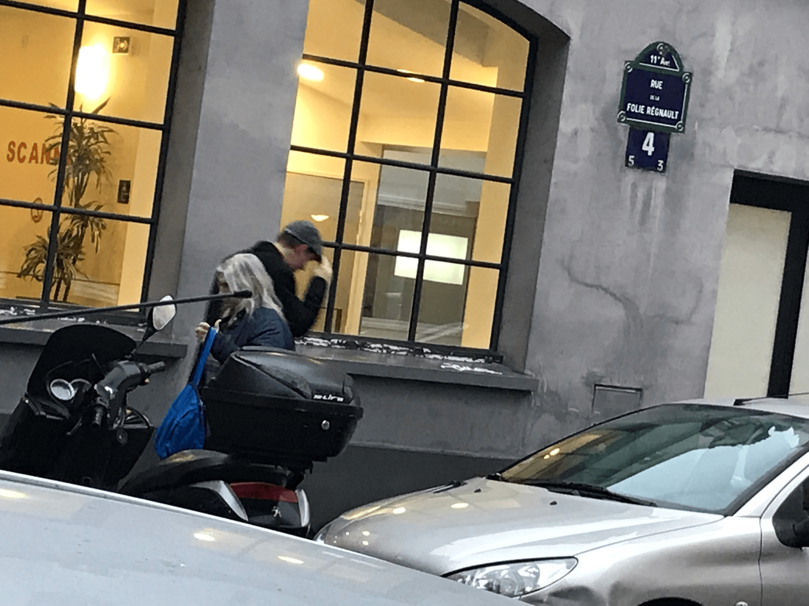
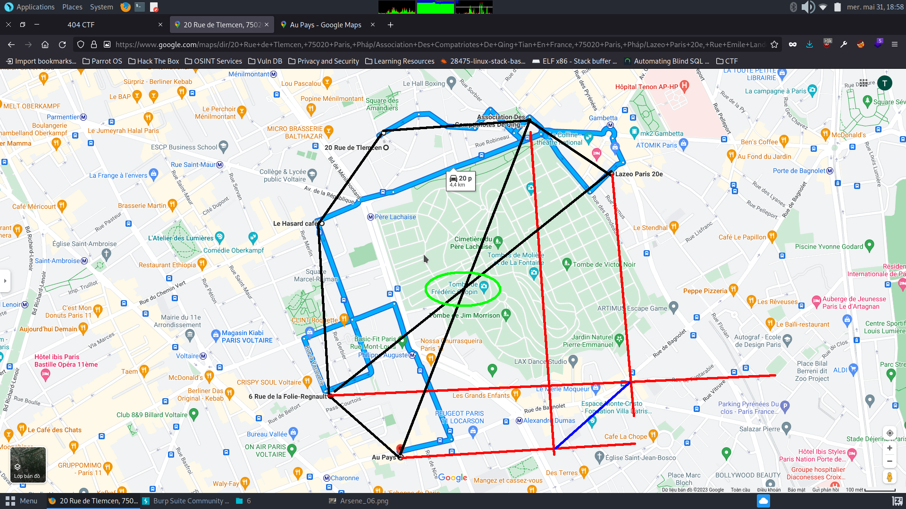

[Link to challenges](https://ctf.404ctf.fr/challenges#Un%20vol%20?%20-41)

## ## Challenge Description

This OSINT challenge requires us to find out where Arsène Lupin hides his loot, given 6 photos of him in Paris. We shall examine those photos one by one. The flag format is **`404CTF{hiding_place}`**

## ## Solution

Let's take a look at the first picture

The location of this photo can be found easily on Google Maps with the name of the Association Building, and street name. 

For the second one, it was a bit different since the Street view of Maps is outdated and doesn't have the construction, but with the street name + 2 building, 1 of bricks 1 in white is enough for us to find.

I keep on finding the location of the rest and pin them on the map. Since they are all clear with names and signs, we should have no problem finding their location at all.

And finally, we need to figure out the relation among those pins. Here is what I found:

After having linked all the pins with black line, I realized that perhap Lupin is trying to create an emerald shape (I tried to fill in the rest with red lines), so I looked for the missing pins but it was pointless. Then I decided to go for the center and voilà, it leads us to "La tombe de Frédéric Chopin"  (Green elipse above).

So, the flag is **`404CTF{la_tombe_de_frederic_chopin}`**
