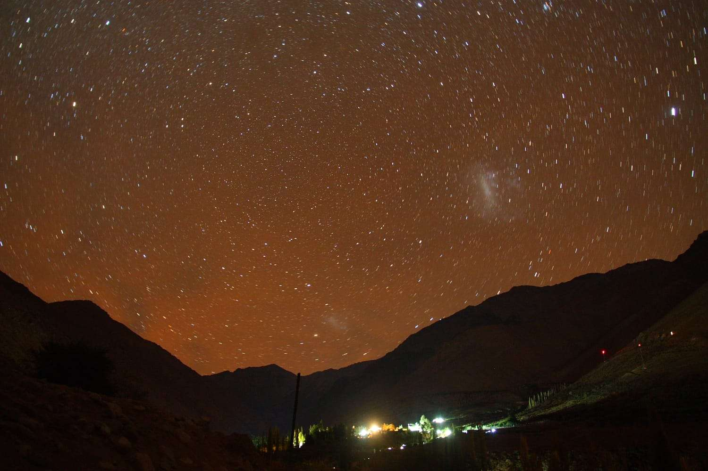

[Link to challenges](https://github.com/ChallengeHackDay/2023-qualif/tree/main/OSINT/A%20starry%20night%20sky)

## ## Challenge Description

This is an OSINT Challenge, in which we are given this photo. We are asked to find the place and the month of shooting under the format **`HACKDAY{COUNTRY_MONTH}`**

## ## Solution

One clue they gave us is the photo credit: taken by G. Dodray. Since the name Dodray is not very common, I tried to search google for that name and I found the name Gilles Dodray, an book author in the domain "observation des objets célestes" and used to work at Lycée Gaston Bachelard. This might be the photographer!

I continued by searching his name on Facebook, and his account showed up. In his photo gallery on the news feed I saw some recent photos looked quite similar to the one above, but with daylight. Then I decided to look into his gallery and voilà! 

This is the photo we are looking for : [Link to his photo](https://www.facebook.com/photo.php?fbid=10221175562875542&set=pb.1139367572.-2207520000.&type=3)

It can clearly be seen that he took this photo on a trip to Chile in May 2022 [Link to his post](https://www.facebook.com/gilles.dodray/posts/pfbid02wje9thYzjxmnCX4sGZA9wf3zCuJ1phTDHZr6jciFuXmKifivXcgPnK2h1zpSsNbYl).

So the flag is  **`HACKDAY{CHILE_MAY}`**. What a nice photo!

## ## Other Solutions

Since I prefer the easy way, I found the other solutions are very interesting and worth learning too.

Here is the [write-up by the developper of the event](https://github.com/ChallengeHackDay/2023-qualif/blob/main/OSINT/A%20starry%20night%20sky/writeup/isnubi-WU.en.md). They look for the largest observation center in the world: the Paranal Observatory and see how did the sky look at 22:00 in different time of the year 2022 and the stars/constellations. I barely have any knowledge on this field so I find this approach very interesting!
