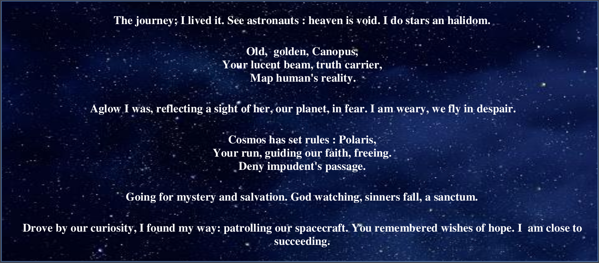
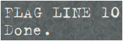

[Link to challenges](https://github.com/ChallengeHackDay/2023-qualif/tree/main/Steganography/Astronaut's%20Poem)

## ## Challenge Description

This is an Stegnography Challenge, in which we are given a pdf containing 1 page of poem only. We are asked to find the constellation in French and in lower case of the constellation containing the found NGC.

## ## Solution

We start with the metadata of the pdf file.

<pre 
  class="command-line" 
  data-prompt="kali@kali $" 
  data-output="4"
><code class="language-bash">
exiftool Astronauts_Poem.pdf
</code>
</pre> 

We will notice this line: **Language                        : https://esolangs.org/wiki/Poetic**

> **Poetic** is an [esoteric programming language](https://esolangs.org/wiki/Esoteric_programming_language) created by [User:JWinslow23](https://esolangs.org/wiki/User:JWinslow23) in 2018. It is a derivative of [brainfuck](https://esolangs.org/wiki/Brainfuck) that encodes instructions into the lengths of words. Programs generally look like abstract poetry, and upon execution, they are turned into a  list of numbers denoting the lengths of the words, and then executed as  instructions.

And there exists an [Official online interpreter](https://web.archive.org/web/20210506123139/https://mcaweb.matc.edu/winslojr/vicom128/final/tio/index.html). After executing the poem we receive:

We return to our poem and search for the line 10. Remember that we need to find a number representing a NGC, so we should try execute the line 10 ourselves. According to the official site of Poetic language, we have:

| Value | Brainfuck Equivalent | Description                                                  |
| :---- | :------------------- | :----------------------------------------------------------- |
| 1     | `[`                  | If the current byte is equal to 0, jump execution to after the matching `2`. |
| 2     | `]`                  | If the current byte is not equal to 0, jump execution to the matching `1`. |
| 3     | `+`                  | Increment the value of the current byte by *next_digit*. If *next_digit* is 0, the value used instead is 10. |
| 4     | `-`                  | Decrement the value of the current byte by *next_digit*. If *next_digit* is 0, the value used instead is 10. |
| 5     | `>`                  | Increment the memory pointer by *next_digit*. If *next_digit* is 0, the value used instead is 10. |
| 6     | `<`                  | Decrement the memory pointer by *next_digit*. If *next_digit* is 0, the value used instead is 10. |
| 7     | `.`                  | Output the value of the current byte as an ASCII character.  |
| 8     | `,`                  | Read a character from the input stream, and write its ASCII value to the current byte. (Note: This fails to update the current byte upon end of input.) |
| 9     | N/A                  | Set the current byte to a random value from 0 to 255.        |
| 0     | N/A                  | End program execution here. This does not end program execution if it is used as an argument for `3`, `4`, `5`, or `6`. |

And the number is derived from the word following these rules:

- If a word is less than 10 letters long, it is converted to that single digit.
- If a word is exactly 10 letters long, it is converted to the digit `0`.
- If a word is more than 10 letters long, it is converted to a series  of digits, representing the number as written in decimal notation (for  example, a 12-letter word becomes `12`).

Applying these to line 10, we obtain this: 

> 5 2 3 9 1 5 2 3 10 3 10 3 10 6 2 4 1 2 5 2 0

5239 : move the memory_pointer and + 9

152310310310 :  start a loop in which we add 10 three times and get back to the position of the 9

the rest is to break out of loop and end. So basically we have 9 * (10 + 10 + 10) = 270.

After this we receive the number 270, and the NGC 270 is in the constellation Cetus, or la constellation de la Baleine in French. So the flag is  **`HACKDAY{baleine}`**.
