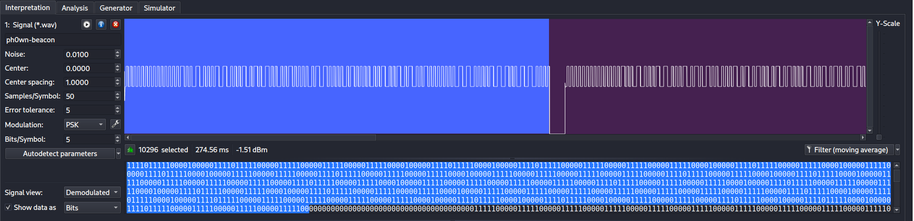
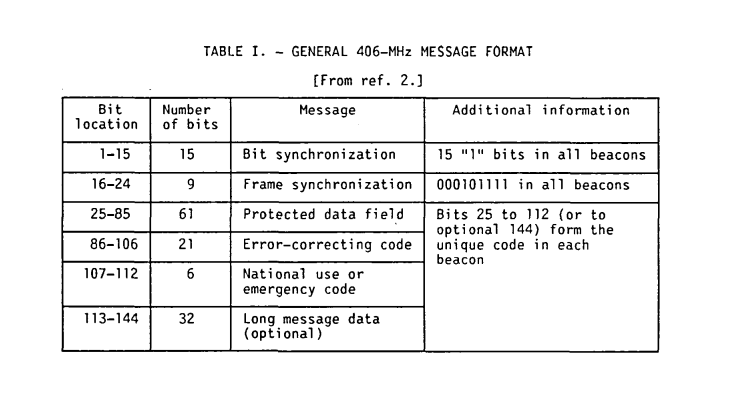
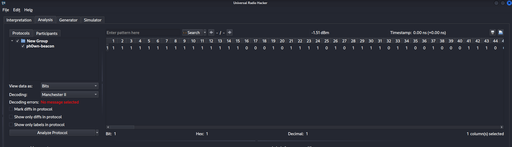
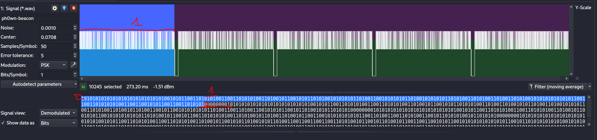

## ## Challenge Description

We are given a wav file [beacon.wav](../../../\assets\CTFs\Ph0wnCTF-2026-Intro/ph0wn-beacon.wav) with a document related to [COSPAS-SARSAT-406-MHz-Emergency-Beacon](https://ntrs.nasa.gov/api/citations/19880017182/downloads/19880017182.pdf), our task is to find the flag with a hint Manchester II.

## ## Solution

So since this is a signal, I use the [Universal Radio Hacker](https://github.com/jopohl/urh) to extract the data from wav file. 

For the parameters I applied as below:

To calculate the samples per symbol: `samples_per_symbol = sample_rate / symbol_rate`
Here sample rate = 20 kHz and symbol rate = 400 bps, samples/symbol ≈ 50. Then we switch to Demodulated view to see the square wave. Each square is either a bit `0` or `1`.



As we can see the signal is sent as short burst with a interval like in the photo, which translated as a series of '0' in decoded.

In the document provided, we can see the structure of a beacon signal start with 15 `1` bit:



Switch to Analysis tab, we can see the 15 consecutive `1`s in the signal:


In order to extract the flag, which probably located in the offset 40-83 in the signal (Check TABLE III in the document). And since the message are cut and transmitted in 5 burst, we need to separate the signal into 5 parts by `00000000` and extract the data from offset 40 to 83. It was easy since URH's Analysis tab already provided us with the offset.



In the end we have 5 parts of the message:

```
011100000110100000110000011101110110111001111011011000110110000101110110011010010100000001110010010111110111001101100101011000110101010101110010011001010100010001111101
```


So the flag is  **`ph0wn{cavi@r_secUreD}`**.


